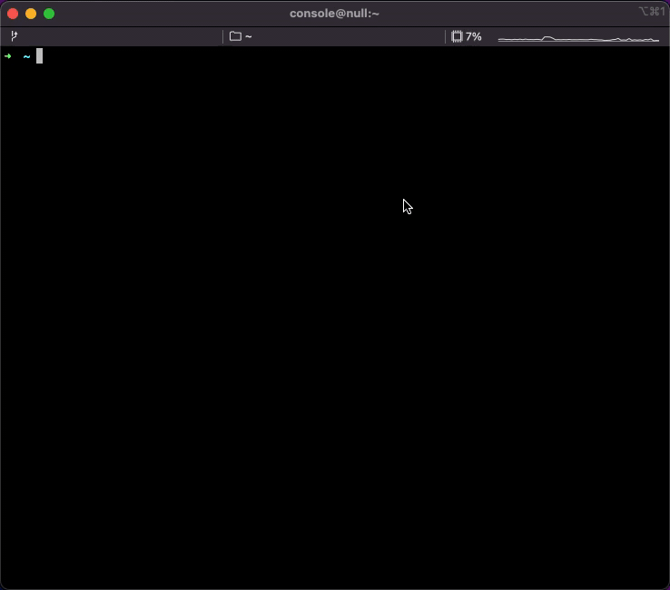

<div align="center">
	<br>
	<br>
	
	<br>
	<br>
	<br>
</div>


<p align='center'>
Terminal-based Snake Game build with Vue + Vite. Powered by <a href="https://github.com/webfansplz/temir">Temir</a> !
</p>


## 📦 Install

```sh
npm install temir-snake-game -g
```

## 🎮 Play

### How to Start

Open the terminal and then enter `temir-sg`.

### Tips

For Windows OS, We recommend use the [hyper](https://github.com/vercel/hyper) terminal to play.

## 📺 Preview



## 📄 License

[MIT LICENSE](./LICENSE)
